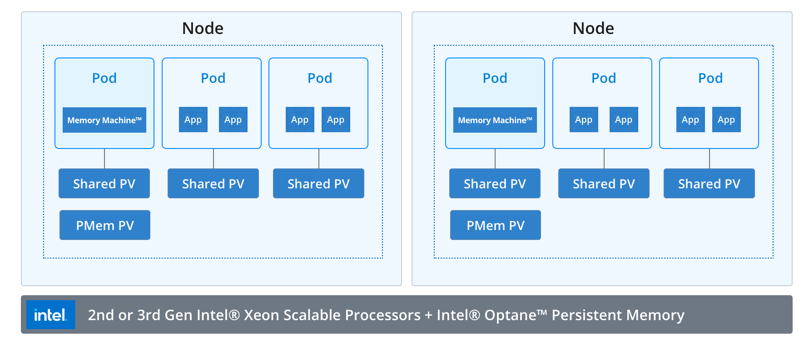

# Memory Machine Container Architecture
To manage containers, Memory Machine runs in a single pod under the `memverge` namespace on each container node, and manages memory in a local PMem-based persistent volume (PV).

Memory Machine uses a supplied script, **config-pmem.sh**, to reconfigure the PMem namespace to `fsdax` mode. A *DaemonSet* is used to create one Memory Machine pod on each node. This pod runs **mvmallocd**, the Memory Machine memory manager.

A local PMem PV is created on top of the configured PMem `fsdax` directory. The Memory Machine pod claims the PV, mounts it, and passes the PMem file to **mvmallocd**.

To enable cross-namespace communication among **mvmallocd** and all applications, a local, shared PV is created for the `memverge` namespace and for each application namespace. These shared PVs mount the same directory on the host machine, so all pods on the same node can access the domain socket.

See the figure titled "Memory Machine Container Architecture" for a pictorial representation of the container configuration.

An **initContainer** in the Memory Machine pod copies Memory Machine binaries and dependent libraries to the shared PV. Before an application pod is started, Memory Machine uses a mutating webhook to inject an **initContainer** into the pod. The **initContainer** copies the binaries and libraries to the directories required by Memory Machine. The **initContainer** also configures Memory Machine environment variables on the application pod.

