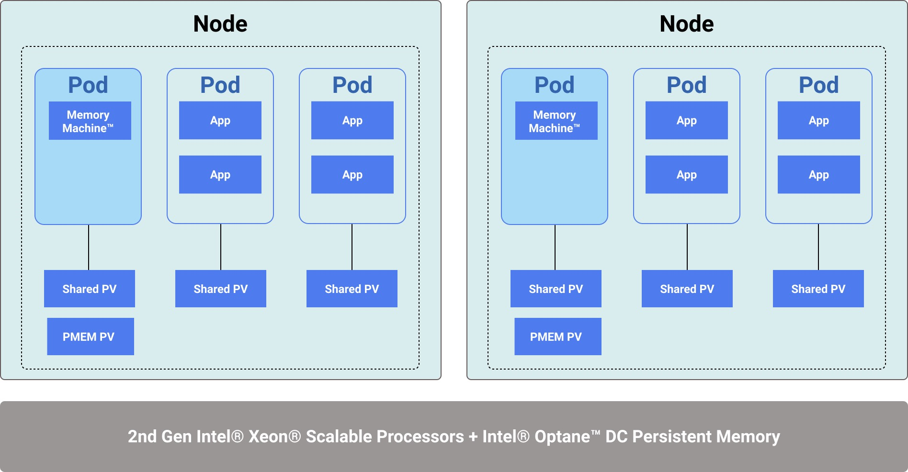

# Memory Machine Container Architecture v0.0.1
To manage containers, Memory Machine runs in a single pod under `memverge` namespace on each container node and manages memory in a local PMEM persistent volume (PV).

Memory Machine uses a supplied script, **config-pmem.sh**, to reconfigure the Persistent Memory namespace to `fsdax` mode. A daemonSet is used to create one Distributed Persistent Memory Engine (DPME) pod on each node. This pod runs **mvmallocd**, the Memory Machine memory manager.

A local PMEM PV is created on top of the configured PMEM `fsdax` directory. The Memory Machine DPME pod claims the PV, mounts it, and passes the PMEM file to **mvmallocd**.

To enable cross-namespace communication **mvmallocd** and all applications, a local shared PV will be created for `memverge` and each application namespace. These shared PVs will mount the same directory on host machine, so all pods on the same node can access to the domain socket.

See "Memory Machine Container Architecture" below for a high-level picture of the container configuration.

An **initContainer** in the DPME pod copies Memory Machine binaries and dependent libraries to the shared PV. Before an application pod is started, Memory Machine uses a mutating webhook to inject an **initContainer** into the pod. The **initContainer** copies these binaries and libraries to the directories required by Memory Machine. The **initContainer** also configures Memory Machine environment variables on the application pod.

